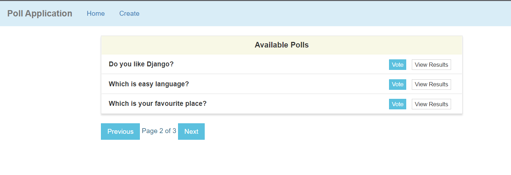
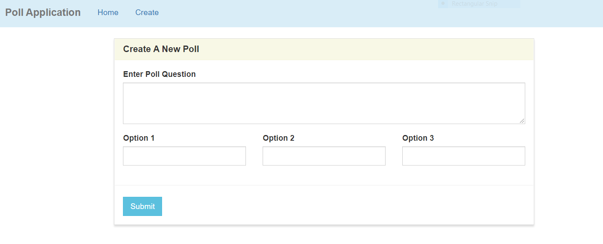
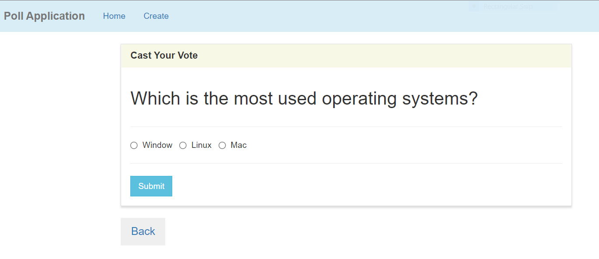
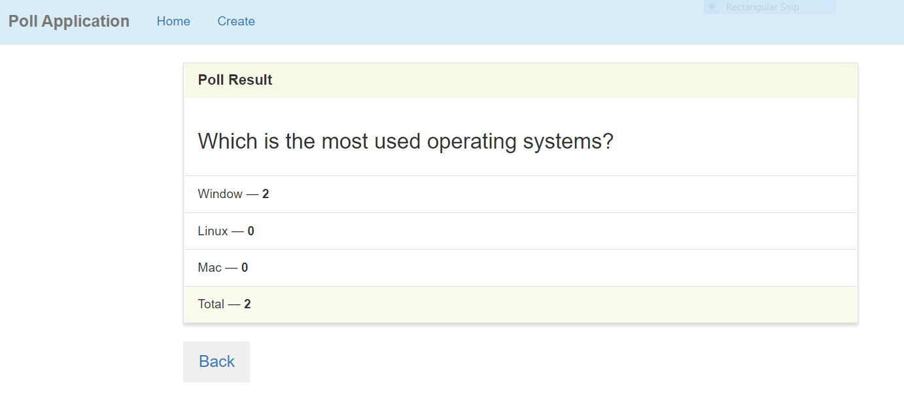

# Polls Application
Django poll application is a polling app.

# About Project
In this poll app project where several polls(Question) are there and you are supposed to vote for them and see the poll results. 
I have created a model name Poll(Question) and a poll has a question and three options(Choice).Each options is associated with a question of poll.

## Features
  - Create Poll
  - Show all poll list
  - Vote for each poll
  - View poll results
  - Apply pagination (i.e Each page contains only three poll(Questions))
### Tech Stack
 - Python, Django,Html, CSS, Bootstrap

## Output

   
  
  
 

## Acknowledgements/Prerequisites
- **Python IDE**
   - [VS Code (Visual Studio Code)](https://code.visualstudio.com/docs/?dv=win)
   - Install following extensions : -
       - Python
       - Code runer
- [Download Python and Install](https://www.python.org/downloads/)
- python.exe path must be set in 'path' environment variable
- For more details link are given below:-
  - [How to download Python and Pycharm](https://www.youtube.com/watch?v=mbryl4MZJms&ab_channel=Telusko)
  - [Download Pycharm](https://www.jetbrains.com/pycharm/download/#section=windows)

### Some Basic Commands ###
- To check python latest version: `` python --version ``
- To check pip: `` pip --version `` 
- To check all packages in your system: `` pip freeze ``
- To check Django install in your sytem or not,type: `` django-admin --version ``
- To install requirements.txt file, type : ``pip install -r requirements.txt``

- Used to two extra packages for this poll application
     1. `` pip install django-widget-tweaks`` run this command and also install in ``settings.py`` file.This command is used for styling the widgets so that website look good.
     2. ``pip install pylint`` This command is used to handle the problem such as **unable to import Django.shortcuts** [For more details click here](https://stackoverflow.com/questions/59800115/unable-to-import-django-shortcuts).
     3. [How to protect your Django secret key using the .env file](https://www.youtube.com/watch?v=myqfTX9ZbTs&ab_channel=CodeBand)
         - [How to protect your Django secret key using the .env file official website](https://pypi.org/project/python-decouple/)

### Initial setup to build Django Project ###
- First we need to create a virtual environment.Using a virtual environment avoids installing Django into a global python environment and we will have exact control over the libraries used in an application.
    - **Step-1:-** Create a project folder on file system like 'Project-django' and open inside VS code.
    - **Step-2:-** Install django in Separate environment.
- We can create virtual environment two ways.
- **First way (Open CMD or Terminal)**
    1. Install virtual environment wrapper :  `` pip install virtualenvwrapper-win ``
    2. Create a new virtual environment : `` mkvirtualenv Env_Name `` Example : ``mkvirtualenv poll_env``
    3. To activate virtual environment : `` workon Env_Name `` Example : ``workon poll_env``
    4. Install Django : `` pip install django ``
    - [How to setup virtual environment for Django project](https://www.youtube.com/watch?v=F_xWv0Q_dLE&ab_channel=GeekyShows)
    - Using this, virtual environment is install in your default working directory(C Drive).In **Envs** folder virtual environment(Env_Name) is present.
    - **Note : -** In terminal virtual environment not seen.In CMD virtual environment see after activate it.To deactivate virtual environment simply type `` deactivate`` and to delete virtual environement ,type ``rmvirtualenv Env_Name`` and Uninstall django,type ``pip uninstall django``
    
 - **Another way to create virtual environment (Open terminal or CMD)**
    1. Create a new virtual environment: `` python -m venv Env_Name ``
    2. To activate virtual environment: `` Env_Name\Scripts\activate.bat`` But on Unix or MacOS: ``source Env_Name/bin/activate`` 
    3. Install Django : `` pip install django ``
      - [How to setup virtual environment for Django project](https://www.youtube.com/watch?v=APOPm01BVrk&ab_channel=CoreySchafer)
      - Using this way, virtual environment is install in your current directory.
      - **Note : -** In terminal virtual environment not seen.In CMD virtual environment see after activate it.To deactivate virtual environment simply type `` deactivate`` and to delete virtual environement ,type ``rmdir Env_Name /s`` and Uninstall django,type ``pip uninstall django``

### After Initial setup ###
 1. Activate virtual environment : `` workon Env_Name``
 2. Create Django Project : `` django-admin startproject PROJECT_NAME``
 3. Create Django Application : `` python manage.py startapp APPLICATION_NAME ``
 4. Install your application in ``settings.py `` file.
 5. Run the sever : `` python manage.py runserver ``
 6. Open website in browser at ``http://localhost:8000`` or admin at ``http://localhost:8000/admin``
 7. Quit the server : ``ctrl+c``
 
 - Whenever you edit your model fields (adding a new one, changing an existing one or altering any of the arguments it takes) then you should always run migrations.
 ``python manage.py makemigrations <app>`` : Create the migrations (generate the SQL commands).
 - ``python manage.py migrate`` : Run the migrations (execute the SQL commands).
 - To create super user, type : ``python manage.py createsuperuser``

